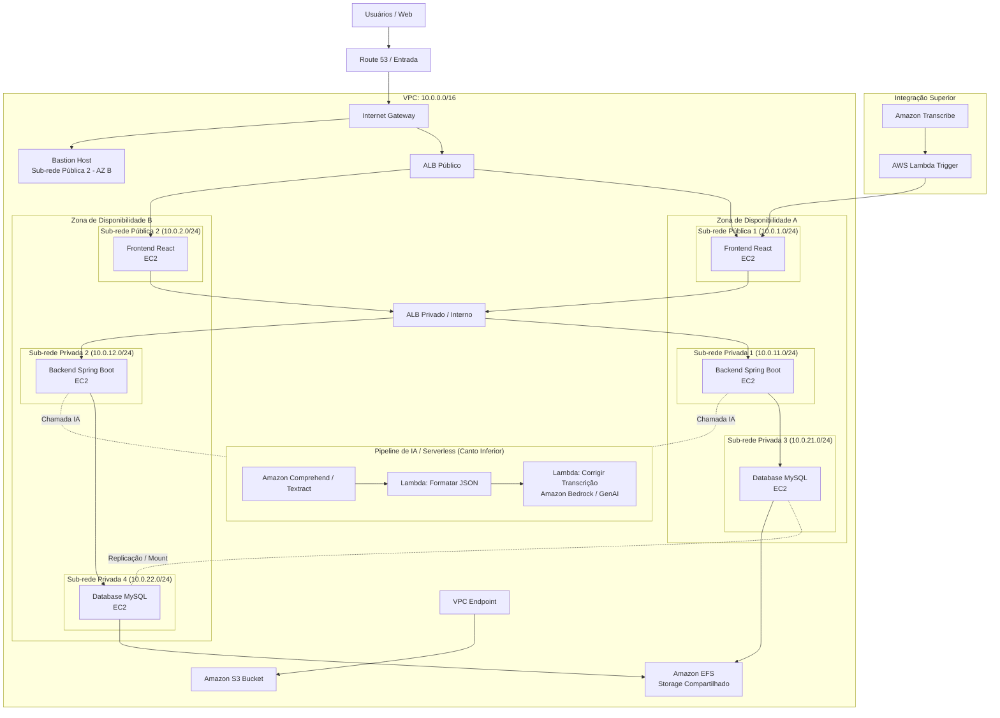

# Infraestrutura AWS com Terraform (Projeto DevOps)

Este repositório contém o código **Terraform (.tf)** completo para provisionar a arquitetura AWS representada no diagrama.

---

## Arquitetura do Projeto



---

##  Estrutura dos Arquivos `.tf`

| Arquivo | Descrição |
| :--- | :--- |
| [`versions.tf`](file:///home/caio/Documents/Faculdade/Devops/TerraformProjeto/versions.tf) | Configuração do provider AWS e versões do Terraform |
| [`variables.tf`](file:///home/caio/Documents/Faculdade/Devops/TerraformProjeto/variables.tf) | Declaração de variáveis parametrizáveis (CIDRs, tipos de EC2, AZs) |
| [`terraform.tfvars.example`](file:///home/caio/Documents/Faculdade/Devops/TerraformProjeto/terraform.tfvars.example) | Exemplo de valores para customização do ambiente |
| [`vpc.tf`](file:///home/caio/Documents/Faculdade/Devops/TerraformProjeto/vpc.tf) | VPC (`10.0.0.0/16`), 2 Sub-redes Públicas, 4 Sub-redes Privadas, Internet Gateway, Rotas e VPC Endpoint S3 |
| [`security_groups.tf`](file:///home/caio/Documents/Faculdade/Devops/TerraformProjeto/security_groups.tf) | Grupos de segurança com isolamento entre camadas (ALBs, Frontend, Backend, MySQL, EFS, Bastion) |
| [`alb.tf`](file:///home/caio/Documents/Faculdade/Devops/TerraformProjeto/alb.tf) | Load Balancers (ALB Público para Frontend e ALB Interno para Backend), Target Groups e Listeners |
| [`compute.tf`](file:///home/caio/Documents/Faculdade/Devops/TerraformProjeto/compute.tf) | Instâncias EC2 (React Frontend, Spring Boot Backend, MySQL Database e Bastion Host) |
| [`storage.tf`](file:///home/caio/Documents/Faculdade/Devops/TerraformProjeto/storage.tf) | Amazon S3 Bucket e Amazon EFS com Mount Targets nas sub-redes privadas de banco |
| [`iam.tf`](file:///home/caio/Documents/Faculdade/Devops/TerraformProjeto/iam.tf) | Funções e políticas IAM para EC2 (SSM, Logs) e Lambdas (Bedrock, S3, Comprehend) |
| [`lambda.tf`](file:///home/caio/Documents/Faculdade/Devops/TerraformProjeto/lambda.tf) | Funções Lambda (Gatilho Superior, Formatar JSON e Corrigir Transcrição via Bedrock) empacotadas via Terraform |
| [`outputs.tf`](file:///home/caio/Documents/Faculdade/Devops/TerraformProjeto/outputs.tf) | Saídas principais (DNS dos ALBs, IPs privados/públicos, DNS do EFS, ARNs das Lambdas) |

---

##  Integração Contínua com os Repositórios (Branch `main`)

As instâncias EC2 são provisionadas via `user_data` para automaticamente clonar, compilar e executar o código-fonte diretamente dos repositórios oficiais na branch **`main`**:

| Camada | Repositório | Stack Tecnológica | Porta / Serviço |
| :--- | :--- | :--- | :--- |
| **Back-end** | [`LuminaPI52CCOA/Back-end`](https://github.com/LuminaPI52CCOA/Back-end.git) | Java 21, Spring Boot 3.x, JPA, Maven | `8080` (Systemd `lumina-backend.service`) |
| **Front-end** | [`LuminaPI52CCOA/Front-End`](https://github.com/LuminaPI52CCOA/Front-End.git) | React 19, Vite, styled-components | `80` (NGINX SPA + Proxy Reverso API) |
| **Database** | *Provisionado via Terraform* | MariaDB 10.5+ / MySQL | `3306` (Banco `lumina_db`) |

### Fluxo de Comunicação e Proxy Reverso
1. O usuário acessa o **ALB Público** na porta `80`.
2. O ALB Público encaminha as requisições para as instâncias **Frontend React** (NGINX).
3. O NGINX serve o bundle estático do React (SPA) e faz **proxy reverso** de todas as chamadas de API (`/usuarios/`, `/clientes/`, `/consultas/`, etc.) para o **ALB Privado/Interno** na porta `8080`.
4. O ALB Interno distribui o tráfego entre as instâncias **Backend Spring Boot**.
5. As instâncias Backend conectam-se ao banco de dados **MySQL / MariaDB** na sub-rede privada e utilizam o **NAT Gateway** para integrações externas (Gemini AI, atualizações de dependências).

---

##  Como Executar

### 1. Pré-requisitos
- [AWS CLI](https://aws.amazon.com/cli/) instalado e configurado (`aws configure`).
- [Terraform](https://developer.hashicorp.com/terraform/downloads) instalado (versão `>= 1.5.0`).

### 2. Configurar Variáveis
Copie o arquivo de exemplo e customize conforme necessário:
```bash
cp terraform.tfvars.example terraform.tfvars
```

### 3. Inicializar o Terraform
```bash
terraform init
```

### 4. Verificar o Plano de Execução
```bash
terraform plan
```

### 5. Aplicar a Infraestrutura na AWS
```bash
terraform apply
```

### 6. Acesso SSH às Instâncias (via Bastion Host e Chave .pem)
A chave privada `labsuser.pem` (par de chaves `vockey` no AWS Academy) já está integrada:

```bash
# Ajustar permissões da chave privada
chmod 400 labsuser.pem

# Acesso direto ao Bastion Host (Ubuntu)
ssh -i labsuser.pem ubuntu@<IP_PUBLICO_BASTION>

# Acesso às instâncias privadas (Backend / Banco) usando o Bastion como Jump Host
ssh -i labsuser.pem -J ubuntu@<IP_PUBLICO_BASTION> ubuntu@<IP_PRIVADO_BACKEND>
```

### 7. Destruir os Recursos (Quando não precisar mais)
```bash
terraform destroy
```


